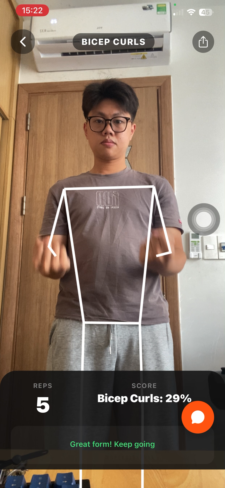
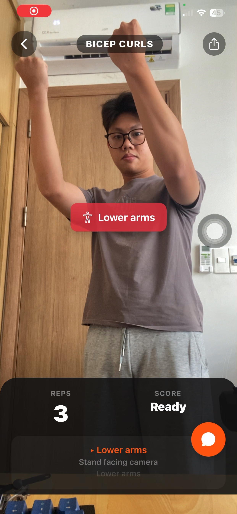

# GDGoC PoseTracker

An AI-powered fitness coaching app built with React Native (Expo) that provides **real-time pose estimation**, **rep counting**, and **form feedback** to help users exercise with proper technique.

## Screenshots

<p align="center">
  
  &nbsp;&nbsp;&nbsp;
  
</p>

## Features

- **On-Device Pose Tracking** — QuickPose SDK for real-time skeleton overlay, rep counting, and hold timing directly on your iPhone
- **Server AI Tracking** — WebSocket-based pose analysis using custom-trained CoreML/MediaPipe models running on a GPU backend
- **Exercise Support** — Bicep Curls, Squats, Lunges, and Plank with exercise-specific feedback
- **Real-Time Form Feedback** — Body position corrections, joint visibility alerts, and exercise-specific coaching cues
- **Conditional Styling** — Skeleton overlay turns green when form score exceeds 80%
- **AI Fitness Chatbot** — LLM-powered chatbot (fine-tuned Gemma) for workout advice and fitness Q&A

## Tech Stack

- **Frontend** — React Native, Expo, TypeScript, Expo Router
- **Pose Estimation** — QuickPose SDK (on-device), Vision + CoreML (server)
- **ML Models** — KNN (bicep), Logistic Regression (squat/lunge/plank), exported via coremltools
- **Backend** — Django (pose API), FastAPI (chatbot), Daphne (ASGI/WebSocket)
- **LLM** — Fine-tuned Gemma 4 E4B-IT (`HuyTuiTen/fitnesschatbot-v1`)
- **Infrastructure** — FPT AI Factory GPU VM (NVIDIA H100)

## Project Structure

```
GDGoCPoseTracker/
├── frontend/          # React Native Expo app
├── backend/           # Chatbot FastAPI backend + LLM
└── detect_model/      # ML training, CoreML export, Django pose API
```

---

# PoseTracker Deployment Process

## Step 1: Setting up the environment on GPU VM

Create SSH key and copy public key to FPT AI Factory (If you don’t have one, ask AI how to generate SSH Key)
```bash
cat ~/.ssh/id_ed25519.pub
```

PUBLIC_IP is obtained from the FPT AI Factory dashboard
```bash
ssh ubuntu@[PUBLIC_IP]
```

After SSH into the server, perform the following steps:

### 1. Update system & Install Python libraries
```bash
sudo apt update && sudo apt upgrade -y
sudo apt install python3-pip python3-venv libgl1 -y
```

### 2. Clone the Source Code
```bash
git clone https://github.com/Lloriozz/GDGoCPoseTracker.git
cd PoseTracker
```

### 3. Initialize Virtual Environment
```bash
python3 -m venv .venv
source .venv/bin/activate
pip install --upgrade pip
pip install -r requirements.txt
pip install daphne # To run the ASGI server
```

---

## Step 2: Django Configuration

To allow the server to receive requests from outside (Internet) and the mobile app, the settings.py file needs to be configured accurately to avoid DisallowedHost or ImproperlyConfigured errors.

### 1. Configure file detect_model/web/server/exercise_correction/settings.py
- **SECRET_KEY**: Ensure it is not empty.
- **ALLOWED_HOSTS**: Add the VM’s IP and * to accept requests from Expo.
- **CORS**: Configure corsheaders to avoid cross-origin errors on mobile.

---

## Step 3: Start Backend Server

Use Daphne to support asynchronous processing (Async), helping to continuously receive image frames without bottlenecks.

```bash
cd detect_model/web/server
source ../../.venv/bin/activate

# Note: Ensure the VM’s Firewall has port 8000 open
daphne -b 0.0.0.0 -p 8000 exercise_correction.asgi:application
```
> **Note:** Ensure that the VM's Firewall has port 8000 open.


### Update latest code from GitHub:
```bash
git stash
git pull origin main
git stash pop
```

### Run server in background (Background process):
```bash
nohup daphne -b 0.0.0.0 -p 8000 exercise_correction.asgi:application > server.log 2>&1 &
```


# ChatBot Deployment Process
This document describes the setup and launch process for the chatbot backend system on the GPU VM server. The backend system is deployed from the GDGoCPoseTracker repository, where the chatbot part is located in the backend directory of the main branch.
## Bước 1: Step 1: Setting up the environment on GPU VM
Before deployment, prepare SSH access to the GPU virtual machine provided on the FPT AI Factory platform.

### 1. Create SSH key and get public key
If you don’t have an SSH key, create a new one and copy the public key to configure access rights on FPT AI Factory
```bash
cat ~/.ssh/id_ed25519.pub
```
2. Connect to GPU VM

The PUBLIC_IP address is provided in the FPT AI Factory dashboard.
```bash
ssh ubuntu@[PUBLIC_IP]
```
After successful login, switch to administrator privileges:
```bash
sudo -i
```
Step 2: Download source code from GitHub

Clone the repository from GitHub:
```bash
git clone https://github.com/Lloriozz/GDGoCPoseTracker.git
cd ~/GDGoCPoseTracker
```
Since the chatbot backend is in the main branch, no need to checkout to another branch if the goal is to deploy the current backend.

You can check the existing branches with the command:
```bash
git branch -a
```
Then navigate to the backend directory:
```bash
cd backend
```
Note: The backend directory contains the chatbot backend source code. The files related to the LLM model are placed in the backend/modelLLM directory according to the current project deployment structure.

Bước 3: Install Python environment

First, update the system package list:
```bash
apt update
```
Install Python 3.11, virtual environment creation tool, and necessary components:
```bash
apt install -y python3.11 python3.11-venv python3-pip git
```
Initialize the virtual environment directly in the backend directory:
```bash
python3.11 -m venv .venv
```
Activate the virtual environment:
```bash
source .venv/bin/activate
```
Upgrade pip:
```bash
python -m pip install --upgrade pip
```
Step 4: Install dependent libraries

Install backend libraries and components for model inference:
```bash
pip install fastapi "uvicorn[standard]" pydantic accelerate sentencepiece protobuf huggingface_hub

pip install torch torchvision torchaudio --index-url https://download.pytorch.org/whl/cu124

pip install git+https://github.com/huggingface/transformers
```
To ensure the environment is activated correctly, you can run again:
```bash
source .venv/bin/activate
```
Step 5: LLM Model Storage Location
The LLM Model (fine-tuned from the original Gemma 4 E4B-IT model) is hosted on Hugging Face and is loaded directly from the following model repository:

HuyTuiTen/fitnesschatbot-v1

download the model directly from Hugging Face via GEMMA_MODEL_ID, or
use the pre-placed for inference.

Step 6: Configure Environment Variables

Before starting the backend, configure the environment variables related to the database and language model backend.

1. Configure PostgreSQL database connection
```bash
export DATABASE_URL='[POSTGRESQL_DATABASE_URL]'
export DATABASE_SCHEMA=public
```
2. Configure language model backend

```bash
export LLM_BACKEND=gemma_local
export GEMMA_MODEL_ID=HuyTuiTen/fitnesschatbot-v1
export GEMMA_DEVICE=cuda
export GEMMA_DTYPE=bfloat16
export GEMMA_QUANTIZATION=none
export GEMMA_CPU_OFFLOAD=false
export GEMMA_OFFLOAD_BUFFERS=false
export GEMMA_GPU_MEMORY_LIMIT_MB=0
export GEMMA_CPU_MEMORY_LIMIT_MB=0
```

Bước 7: Start the backend server

# Run server in public mode on port 8000
```bash
python -m uvicorn app.main:app --host 0.0.0.0 --port 8000
```

Note: The chatbot’s knowledge base is built according to the architecture of Karpathy’s LLM Wiki, so you can easily supplement data for the chatbot by adding new sources with the ingest process; detailed instructions are presented in the INGEST_WORKFLOW.md file located in the knowledge directory within the backend section.
text